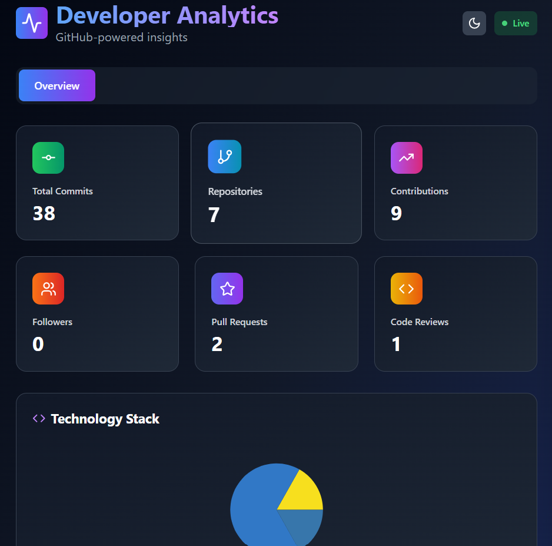

# GitHub Analytics Dashboard

A modern, visually-rich dashboard for developers to analyze their GitHub activity, repositories, language usage, and contributions. Built with React, Tailwind CSS, and Recharts, this app provides live insights into your GitHub profile using the GitHub API and GraphQL.



## Features

- 📊 **Overview of GitHub stats:** Commits, repositories, contributions, followers, pull requests, and code reviews.
- 🧑‍💻 **Technology stack breakdown:** Interactive pie chart of your most-used programming languages.
- 🌗 **Dark/Light mode:** Toggle between beautiful dark and light themes.
- 📦 **Export analytics:** Download your stats as a JSON file.
- ⚡ **Live data:** Fetches up-to-date information directly from your GitHub account.

## Getting Started

### Prerequisites

- Node.js (v18 or higher recommended)
- A GitHub personal access token (with `repo` and `read:user` scopes)

### Setup

1. **Clone the repository:**
   ```sh
   git clone https://github.com/NiteshChaudhari-exe/My-Github-Analysics.git
   cd my-github-analysics
   ```
2. **Install dependencies:**
   ```sh
   npm install
   ```
3. **Create a `.env` file** in the root directory and add your GitHub token:
   ```env
   REACT_APP_GITHUB_TOKEN="your_token_here"
   ```
4. **Start the development server:**
   ```sh
   npm start
   ```
   Open [http://localhost:3000](http://localhost:3000) to view it in your browser.
